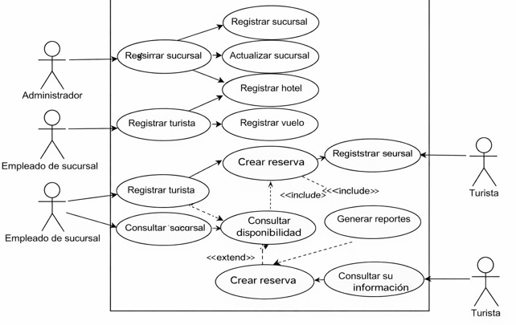
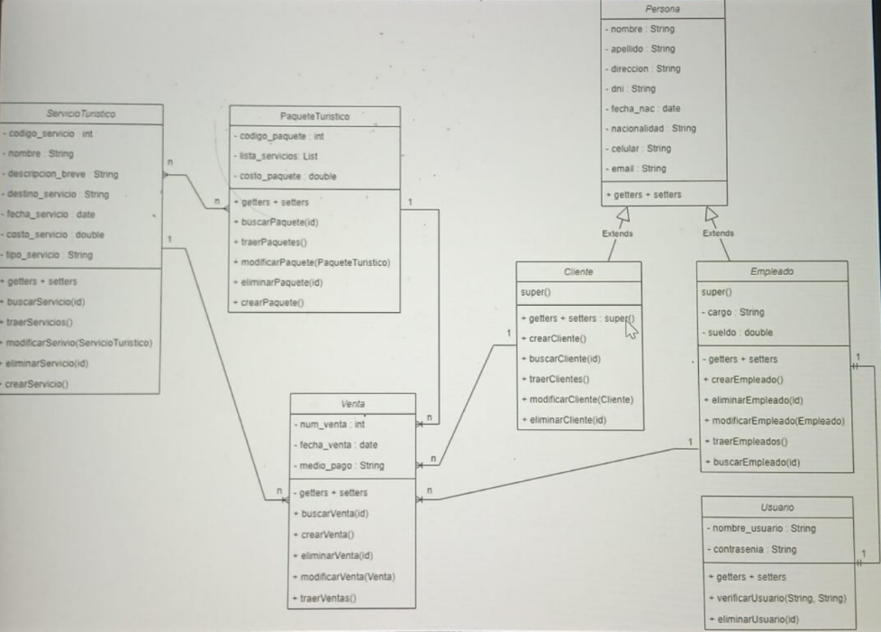

# 📦 Entregables – Diagrama de Casos de Uso

## 1️⃣ Diagrama de Casos de Uso

### 👥 a. Actores (mínimo 3)

El sistema contará con los siguientes actores:

1. 🛠️ **Administrador**  
2. 🏢 **Empleado de sucursal**  
3. 🌎 **Turista**

---

### 📋 b. Casos de Uso (mínimo 8)

El sistema deberá incluir al menos los siguientes casos de uso:

1. 🔐 Iniciar sesión  
2. 📝 Registrar turista  
3. 📅 Gestionar reservas  
4. 🔎 Consultar disponibilidad  
5. 📊 Generar reportes  
6. 🏬 Administrar sucursales  
7. ✏️ Actualizar información de servicios  
8. ❌ Cancelar reserva  

---

### 🔗 c. Relaciones requeridas

El diagrama deberá incluir como mínimo:

- ➕ 1 relación **<<include>>**  
- 🔄 1 relación **<<extend>>**

Estas relaciones deberán representarse correctamente en el diagrama según la notación estándar de UML.

# 📦 Entregables – Diagrama de Clases

## 2️⃣ Diagrama de Clases

El sistema deberá incluir un **mínimo de 7 clases**.

### 🏗️ Clases (ejemplo)

Algunas clases sugeridas son:

- 🏢 **Sucursal**  
- 🏨 **Hotel**  
- ✈️ **Vuelo**  
- 🌎 **Turista**  

*(Se deberán agregar al menos 3 clases adicionales para cumplir con el mínimo requerido.)*

---

## 📋 Requisitos del Diagrama

El diagrama de clases debe incluir obligatoriamente:

### 🔎 Estructura de las Clases

- 📌 **Atributos** con su respectivo **tipo de dato**.  
- ⚙️ **Métodos** definidos en cada clase.  

---

### 🔗 Relaciones

El diagrama debe representar:

- 🔢 **Relaciones con cardinalidad** (1..1, 1..*, 0..1, etc.).  
- 🧩 Al menos **1 relación de Composición**.  
- 🤝 Al menos **1 relación de Agregación**.  

